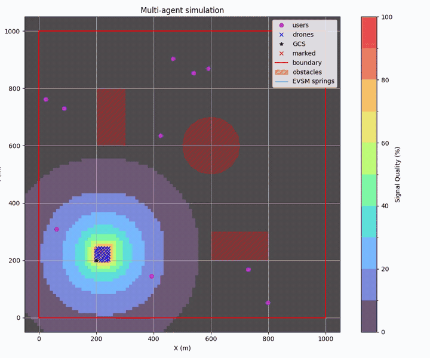
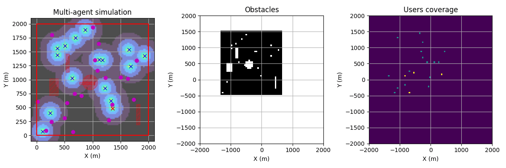
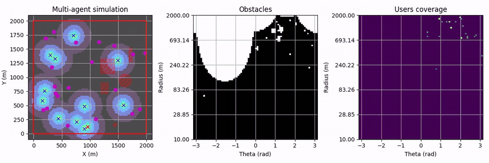
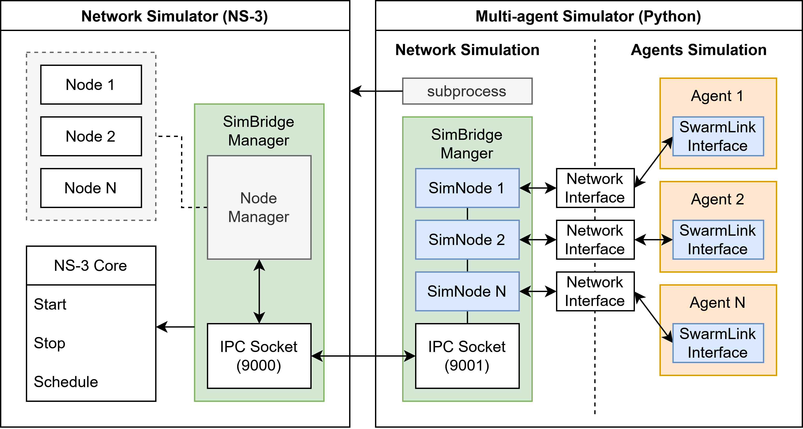

# uav-swarm-sim

An UAV swarm network simulator based on Python and NS-3 (C++).

This repository contains the code developed for the Master's final project:
[UAV Swarm Network Simulator](docs/UAV_Swarm_Network_Simulator_for_Emergency_Communications.pdf)

> **⚠️ Notice:** This code is currently being refactored and is not functional.  
> For a working version, check the last release: [MSc thesis 2025](https://github.com/pabloramesc/uav-swarm-sim/releases/tag/thesis-2025)

## Overview

This project provides an UAV swarm simulator to demonstrate how autonomous quadcopters can form a decentralized ad-hoc network to restore mobile communications in emergency scenarios. To optimize UAV placement, this work develops and evaluates two decentralized swarming algorithms that enable drones to self-organize and provies users coverage efficiently.

The simulator is implemented in Python and includes multi-agent dynamics, 3D environment with obstacles, and visualization tools. The application is integrated with [NS-3 network simulator](https://www.nsnam.org/) to provide realistic wireless communication modeling and full protocol-stack simulation.

## Swarming Algorithms

This porject is focused on two swarming algorithms: Extended Virtual Spring Mesh (EVSM)
and Swarming Deep Q-Network (SDQN).

### EVSM (Extended Virtual Sping Mesh)

EVSM is a modified version of the original algorithm ([Derr et al., 2011](https://doi.org/10.1109/TIE.2011.2130492)) with improved collision avoidance. It is virtual forces algorithm that simulate springs between UAVs to maintain uniform spacing. The spring mesh is constructed using the acute angle test, forming a fully connected planar graph that converges into a hexagonal uniform pattern. Damping and exploration forces help stabilize the swarm and enable rapid deployment.

<table style="width:100%; table-layout:fixed;">
  <tr>
    <th style="width:50%;">EVSM with ideal communications</th>
    <th style="width:50%;">EVSM with network simulation</th>
  </tr>
  <tr>
    <td style="width:50%; text-align:center;">
      
    </td>
    <td style="width:50%; text-align:center;">
      
    </td>
  </tr>
</table>

### SDQN (Swarm Deep Q-Network)

SDQN uses the Deep Q-Network (DQN) algorithm in a Centralized Training with Decentralized Execution (CTDE) setup. It learns optimal UAV deployment strategies to adapt to complex environments. Each UAV encodes its near environment into a 3-channel image, and a difference reward scheme is used to promote users coverage, mantain network connectivity, and avoid obstacles.

Two frame representations are used: a **cartesian grid frame** and a **log-polar frame**. The log-polar representation provides high resolution for near details while still capturing distant features.

| Cartesian grid frame            |
| ------------------------------- |
|  |

| Log-polar frame                     |
| ----------------------------------- |
|  |

## NS-3 Integration

The simulator combines a Python-based multi-agent environment with the NS-3 network simulator (C++).
The two components communicate via IPC sockets using the **SimBridge** protocol, with NS-3 acting as UDP server (port 9000) and Python as client (port 9001).

<div align="center">
    
</div>

**SimBridge** connects NS-3 to Python by scheduling events (e.g. update drone position) and registering callbacks (e.g. data packet reception). **SimBridgeManager** processes commands, executing node actions (send packet, change position) or NS-3 control functions (start/stop the simulation). Packet reception uses callbacks to forward data to the Python simulator. The simulation runs in real-time best-effort mode, though high event loads can cause NS-3 to lag.

## Installation

1. Clone the main repository:

    ```bash
    git clone https://github.com/pabloramesc/uav-swarm-sim.git
    cd uav-swarm-sim
    ```

2. **Optional:** create a virtual environment for Python 3.12 (recommended version)
    ```bash
    python -m venv .venv
    source .venv/bin/activate
    ```

3. Install requirements:
    ```bash
    pip install -r requirements.txt
    ```

4. Install dqn-lab:
    ```bash
    git submodule update --init --recursive libs/dqn-lab
    pip install -e libs/dqn-lab
    pip install -r libs/dqn-lab/requirements.txt
    ```

5. **Optional:** Install NS-3 (required for network simulation)

    Run NS-3 setup bash script to install dependencies, clone repository, and build NS-3:
    ```bash
    cd ns3
    sh setup.sh
    ```
    If errors occur during installation run `setup.sh` commands step by step
    and check the [installation guide](https://www.nsnam.org/docs/installation/html/index.html) for more details.


## License

This project is licensed under the MIT - see the [LICENSE](LICENSE) file for details.
